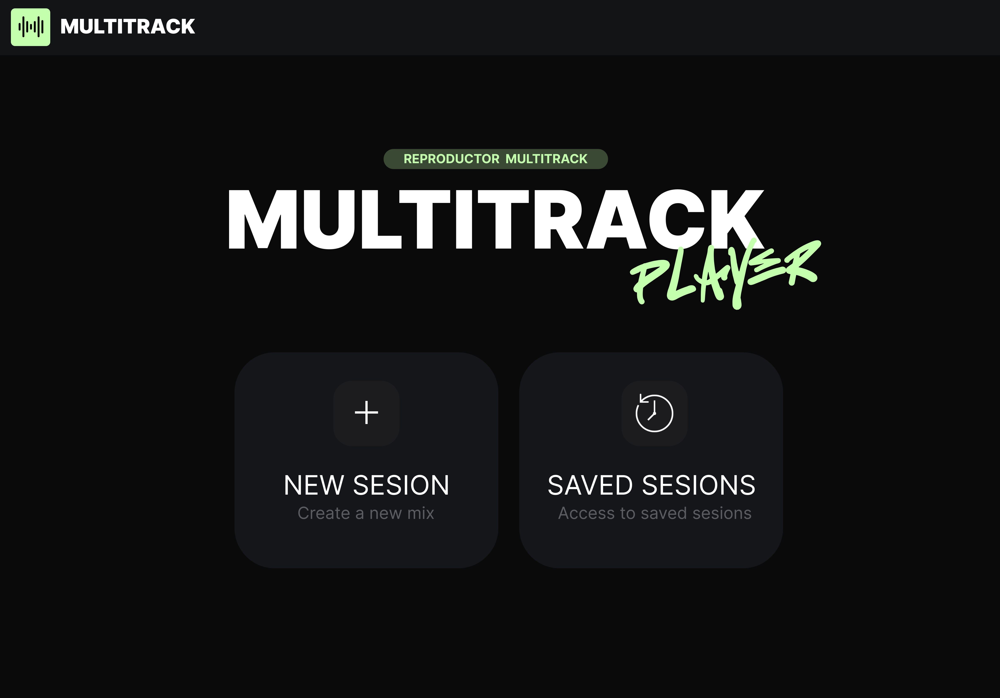
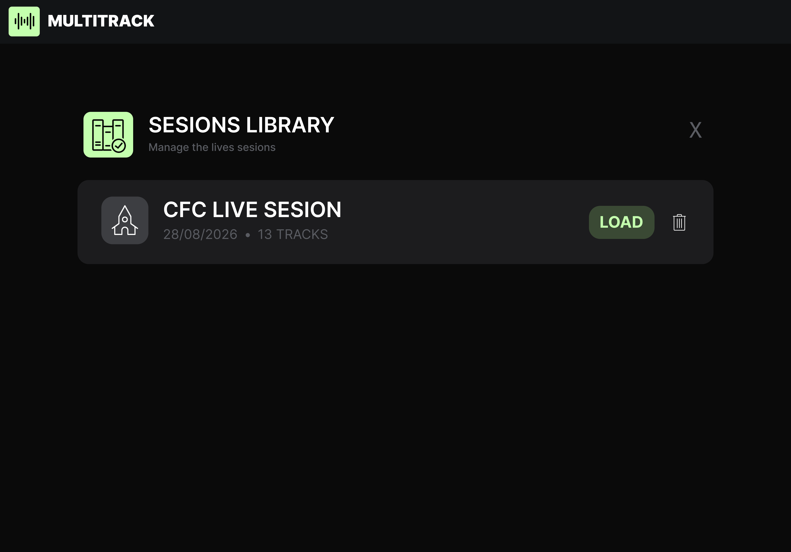
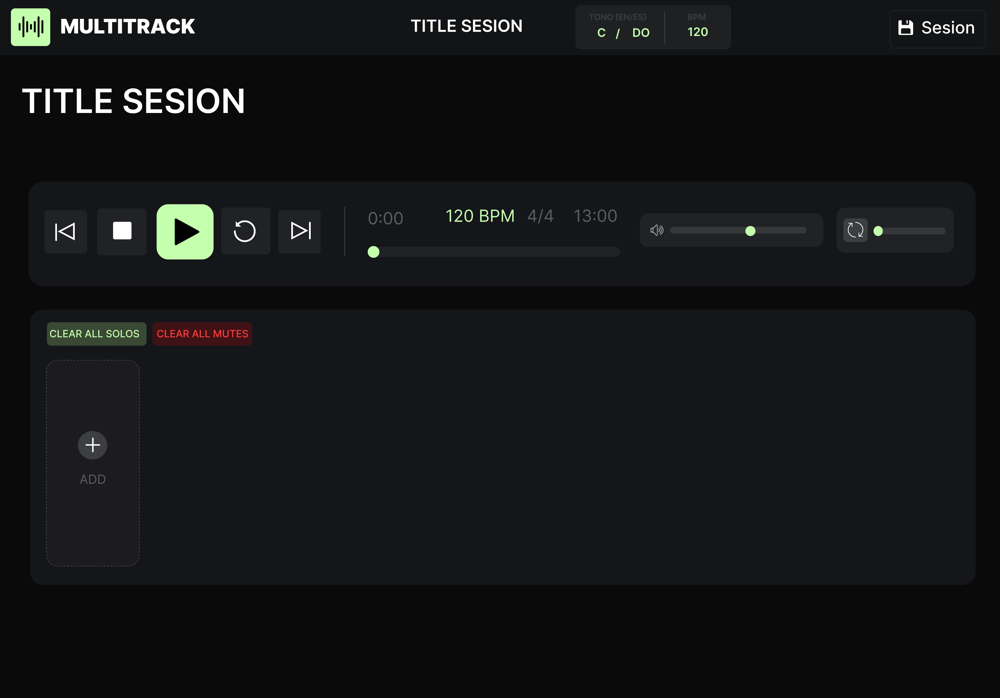
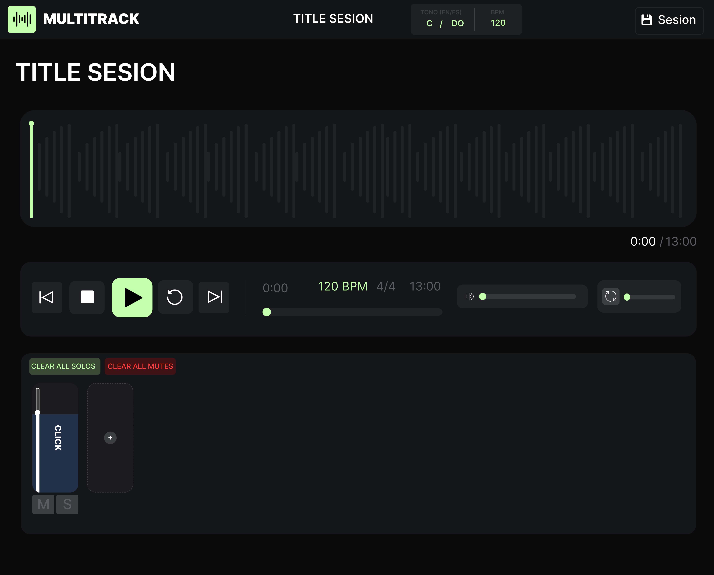

# 🎵 Multitracks App

[](https://flutter.dev/)
[](https://dart.dev/)

Aplicacion para musicos , cargar multitracks para ensayos u eventos 

🔹 Características
- Carga de tracks individuales como click, secuencias etc.
- Faders, mutes, solos
- Reoruccion, permite mover la pista.


# 📂 Estructura del proyecto

```bash
assets/                  # Imágenes y recursos
docs/                    # Capturas de pantalla y GIFs para README
lib/
├── main.dart            # Punto de entrada
├── config/              # Configuraciones y constantes generales
├── data/                # Modelos y repositorios de datos
├── providers/           # Providers de estado
├── services/            #  Servicios
├── widgets/             # Wdgets
└── screens/             # Pantalas

```

## 💻 Capturas de pantalla
<!--    -->


## 🎨 Diseño

 
 

